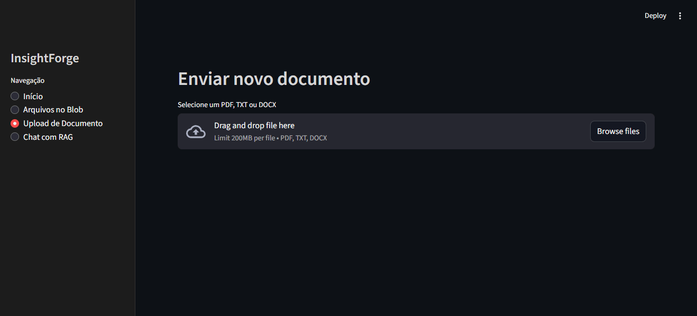
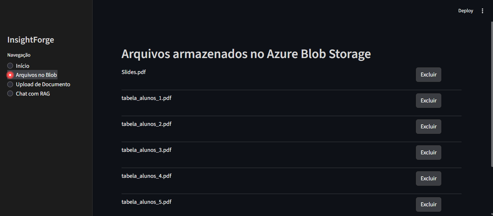
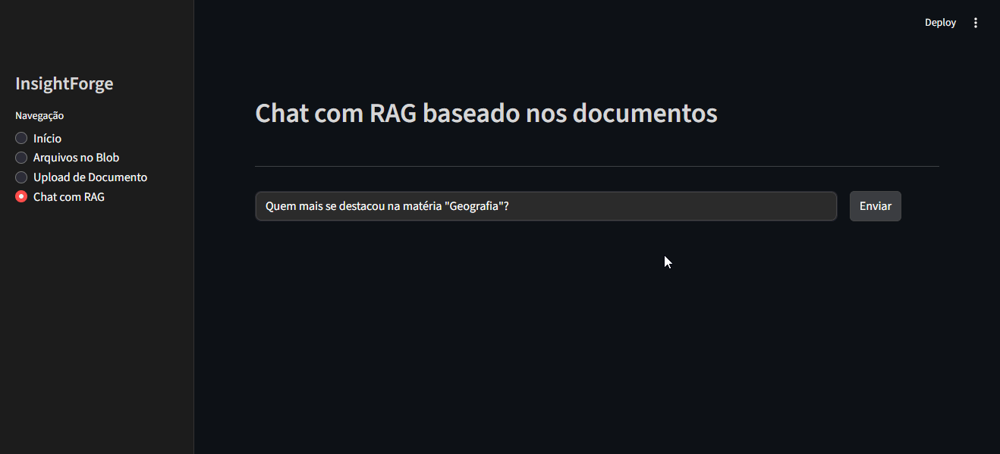

# InsightForge
## Plataforma de RAG inteligente utilizando Azure + IA Generativa

O **InsightForge** realiza análise inteligente de documentos. É capaz de transformar PDFs, DOCX e TXT em conhecimento consultável via um chat em linguagem natural.  
O sistema foi projetado como uma solução de **Engenharia de IA aplicada**, utilizando:

- Infraestrutura de IA na Azure  
- RAG (Retrieval Augmented Generation) profissional  
- Agentes autônomos  
- Azure OpenAI (GPT-4o + embeddings)  
- Pipelines de indexação + chunking + limpeza de texto  
- FastAPI no backend  
- Streamlit no frontend  

---

# Demonstração

- **Upload**


- **Listagem/Exclusão**


- **Chat**


---

# Funcionalidades

- **Upload de documentos (PDF, TXT, DOCX)**
- Armazenamento seguro no **Azure Blob Storage**
- Extração inteligente com **Azure AI Document Intelligence**
- Limpeza do texto (remoção de quebras, espaços, redundâncias)
- Divisão automática em **chunks fixos** para indexação eficiente
- Geração de **embeddings vetoriais** (Azure OpenAI)
- Indexação no **Azure AI Search** com:
  - Vector search (HNSW)
  - Semantic search
  - Hybrid search
- Execução de perguntas em linguagem natural usando um pipeline **RAG completo**
- Agentes inteligentes responsáveis por:
  - **Indexação**
  - **Busca**
  - **Geração de respostas**
  - **Orquestração**
- Chat estilo ChatGPT desenvolvido em **Streamlit**
- URLs de documentos protegidas via **SAS Token automático**
- Exclusão de documentos + remoção automática dos chunks no índice

---

# Como funciona

O InsightForge é composto por quatro grandes componentes:

---

## 🔹 1. **Pipeline de Processamento de Documentos (Upload → Indexação)**

1. Usuário envia um PDF/TXT/DOCX pelo Streamlit  
2. O arquivo é salvo no **Azure Blob Storage**  
3. O `Document Intelligence` extrai texto e estrutura  
4. O `text_cleaner` remove ruído, espaços e formatação  
5. O `chunker` divide o texto em blocos fixos (ex.: 1.200 caracteres)  
6. Cada chunk recebe um **embedding** (Azure OpenAI)  
7. Tudo é enviado ao **Azure AI Search** (indexação vetorial + semântica)  
8. O documento está pronto para consultas via RAG  

---

## 🔹 2. **Pipeline RAG (Pergunta → Resposta)**

1. Usuário envia uma pergunta no chat  
2. O SearchAgent faz:
   - Hybrid search (texto + embedding)
   - Retorna os trechos mais relevantes  
3. O Orchestrator envia contexto + pergunta para o AnswerAgent  
4. O GPT-4o gera uma resposta fundamentada nos trechos  
5. O frontend exibe mensagem + fontes + links SAS dos arquivos  

---

## 🔹 3. **Agentes Inteligentes**

### **IndexAgent**
Responsável por:
- extrair texto  
- limpar texto  
- chunking  
- embeddings  
- indexação no Azure Search  

### **SearchAgent**
Executa:
- hybrid search  
- semantic search fallback  
- vector search fallback  

E retorna:
- trechos relevantes  
- score  
- seção  
- nome do arquivo  
- SAS URL do blob  

### **AnswerAgent**
Recebe:
- pergunta  
- trechos do Azure Search  

Usa:
- GPT-4o com prompt controlado  
- Proíbe alucinação  
- Responde somente com base no contexto  

### **AgentOrchestrator**
Componente que coordena todo o fluxo:
- chama os agentes corretos  
- consolida as respostas  
- retorna o JSON final para o frontend  

---

# Tecnologias

### **Backend**
- Python 3.11  
- FastAPI  
- Pydantic  
- Uvicorn  

### **Frontend**
- Streamlit  

### **IA / Azure**
- Azure OpenAI (GPT-4o, embeddings)
- Azure AI Document Intelligence
- Azure AI Search (vector, semantic, hybrid)
- Azure Blob Storage
- SAS Token generation
- Azure AI Foundry (monitoramento / autenticação)

---

# Instalação

```bash
git clone https://github.com/seuusuario/insightforge
cd insightforge
pip install -r requirements.txt
```
## Configuração do Ambiente
## Executar
- Backend
```bash
uvicorn backend.app:app --reload
```

-Frontend
```bash
streamlit run frontend/app.py
```
## Licença
MIT License.

## Autor
Rafael Gutierres - Engenheiro de IA
- LinkedIn: linkedin.com/in/rafaelgutierres